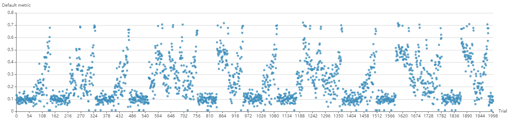
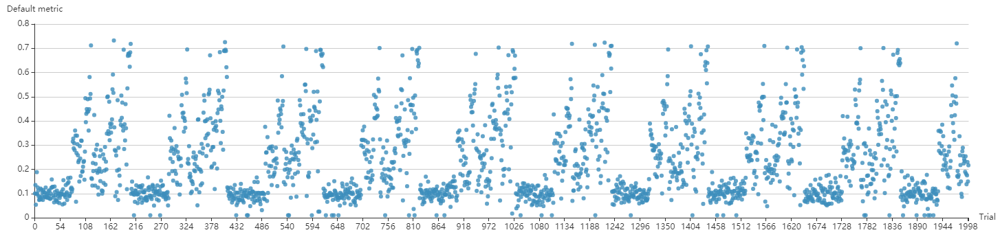

# NNI 中使用 Hyperband

## 1. 介绍

[Hyperband](https://arxiv.org/pdf/1603.06560.pdf) 是一种流行的自动机器学习算法。 Hyperband 的基本思想是对配置分组，每组有 `n` 个随机生成的超参配置，每个配置使用 `r` 次资源（如，epoch 数量，批处理数量等）。 当 `n` 个配置完成后，会选择最好的 `n/eta` 个配置，并增加 `r*eta` 次使用的资源。 最后，会选择出的最好配置。

## 2. 实现并行

首先，此示例是基于 MsgDispatcherBase 来实现的自动机器学习算法，而不是基于 Tuner 和 Assessor。 这种实现方法下，Hyperband 集成了 Tuner 和 Assessor 两者的功能，因而将它叫做 Advisor。

其次，本实现完全利用了 Hyperband 内部的并行性。 具体来说，下一个分组不会严格的在当前分组结束后再运行。 只要有资源，就可以开始运行新的分组。 If you want to use full parallelism mode, set `exec_mode` with `parallelism`.

Or if you want to set `exec_mode` with `serial` according to the original algorithm. In this mode, the next bucket will start strictly after the current bucket.

`parallelism` mode may lead to multiple unfinished buckets, and there is at most one unfinished bucket under `serial` mode. The advantage of `parallelism` mode is to make full use of resources, which may reduce the experiment duration multiple times. The following two pictures are the results of quick verification using [nas-bench-201](../NAS/Benchmarks.md), picture above is in `parallelism` mode, picture below is in `serial` mode.

If you want to reproduce these results, refer to the example under `examples/trials/benchmarking/` for details.

## 3. 用法

To use Hyperband, you should add the following spec in your experiment's YAML config file:

    advisor:
      #choice: Hyperband
      builtinAdvisorName: Hyperband
      classArgs:
        #R: the maximum trial budget
        R: 100
        #eta: proportion of discarded trials
        eta: 3
        #choice: maximize, minimize
        optimize_mode: maximize
        #choice: serial, parallelism
        exec_mode: parallelism
    

Note that once you use Advisor, you are not allowed to add a Tuner and Assessor spec in the config file. If you use Hyperband, among the hyperparameters (i.e., key-value pairs) received by a trial, there will be one more key called `TRIAL_BUDGET` defined by user. **By using this `TRIAL_BUDGET`, the trial can control how long it runs**.

For `report_intermediate_result(metric)` and `report_final_result(metric)` in your trial code, **`metric` should be either a number or a dict which has a key `default` with a number as its value**. This number is the one you want to maximize or minimize, for example, accuracy or loss.

`R` and `eta` are the parameters of Hyperband that you can change. `R` means the maximum trial budget that can be allocated to a configuration. Here, trial budget could mean the number of epochs or mini-batches. This `TRIAL_BUDGET` should be used by the trial to control how long it runs. Refer to the example under `examples/trials/mnist-advisor/` for details.

`eta` means `n/eta` configurations from `n` configurations will survive and rerun using more budgets.

Here is a concrete example of `R=81` and `eta=3`:

|   | s=4  | s=3  | s=2  | s=1  | s=0  |
| - | ---- | ---- | ---- | ---- | ---- |
| i | n r  | n r  | n r  | n r  | n r  |
| 0 | 81 1 | 27 3 | 9 9  | 6 27 | 5 81 |
| 1 | 27 3 | 9 9  | 3 27 | 2 81 |      |
| 2 | 9 9  | 3 27 | 1 81 |      |      |
| 3 | 3 27 | 1 81 |      |      |      |
| 4 | 1 81 |      |      |      |      |

`s` means bucket, `n` means the number of configurations that are generated, the corresponding `r` means how many budgets these configurations run. `i` means round, for example, bucket 4 has 5 rounds, bucket 3 has 4 rounds.

For information about writing trial code, please refer to the instructions under `examples/trials/mnist-hyperband/`.

## 4. 未来的改进

The current implementation of Hyperband can be further improved by supporting a simple early stop algorithm since it's possible that not all the configurations in the top `n/eta` perform well. Any unpromising configurations should be stopped early.

In the current implementation, configurations are generated randomly which follows the design in the [paper](https://arxiv.org/pdf/1603.06560.pdf). As an improvement, configurations could be generated more wisely by leveraging advanced algorithms.